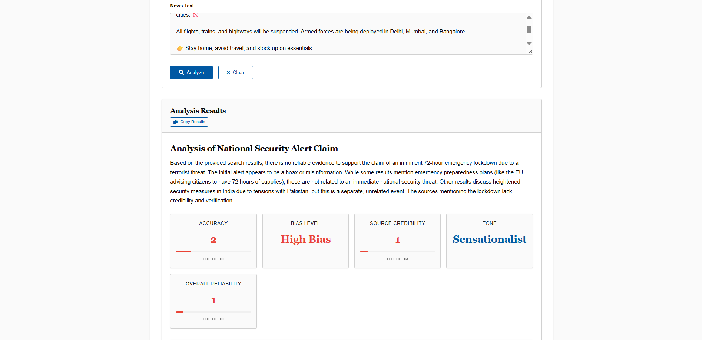

# Verifynd 

[](https://fastapi.tiangolo.com/)
[](https://www.python.org/)
[](https://ai.google.dev/)
[](https://opensource.org/licenses/MIT)

> AI-powered news verification platform that helps combat misinformation by analyzing and summarizing news articles

<p align="center">
  
</p>

## 📋 Table of Contents

- [Features](#-features)
- [Demo](#-demo)
- [Tech Stack](#-tech-stack)
- [Installation](#-installation)
- [Usage](#-usage)
- [API Reference](#-api-reference)
- [Project Structure](#-project-structure)
- [Contributing](#-contributing)
- [License](#-license)

## ✨ Features

<table>
<tr>
  <td width="35%">
    <h3>📰 Latest News</h3>
    <p>Stay updated with recent news articles from trusted sources with one-click access to read or analyze any article.</p>
  </td>
  <td>
    
  </td>
</tr>
<tr>
  <td>
    <h3>📝 Summarize Articles</h3>
    <p>Get concise summaries of any news article by simply providing the URL. Save time while staying informed.</p>
  </td>
  <td>
    
  </td>
</tr>
<tr>
  <td>
    <h3>🔬 Analyze News Content</h3>
    <p>Perform in-depth analysis of news articles either by pasting text or providing a URL to verify authenticity.</p>
  </td>
  <td>
    
  </td>
</tr>
</table>

### Analysis Metrics

Our AI analyzes news content across multiple dimensions:

- ✅ **Accuracy Score**: Evaluates factual accuracy on a scale of 1-10
- ⚖️ **Bias Level**: Detects political or ideological bias
- 🏛️ **Source Credibility**: Assesses publishing source reputation (1-10)
- 🎭 **Tone Analysis**: Identifies the article's emotional tone
- 🌟 **Overall Reliability**: Comprehensive trustworthiness rating (1-10)

## 🚀 Demo

*Coming soon! In the meantime, follow the installation instructions below to run Verifynd locally.*

## 🛠️ Tech Stack

### Backend
- **[Python](https://www.python.org/)** - Core programming language
- **[FastAPI](https://fastapi.tiangolo.com/)** - High-performance web framework
- **[Langchain](https://python.langchain.com/docs/get_started)** - Framework for LLM application development
- **[Google Generative AI (Gemini 1.5 Flash)](https://ai.google.dev/)** - Language model for analysis
- **[Tavily AI](https://tavily.com/)** - Search API for gathering information
- **[Crawl4AI](https://github.com/crawl4ai/crawl4ai)** - Advanced web crawling and content extraction
- **[Uvicorn](https://www.uvicorn.org/)** - ASGI server for running the FastAPI application

### Frontend
- **HTML5/CSS3** - Modern web standards for structure and styling
- **JavaScript** - Client-side interactivity and dynamic content loading
- **[Jinja2](https://jinja.palletsprojects.com/)** - Templating engine for server-side rendering
- **[Font Awesome](https://fontawesome.com/)** - Icon library for enhanced UI elements

## 📦 Installation

### Prerequisites

- Python 3.10 or higher
- `uv` package manager

### Step-by-step Setup

1. **Clone the repository**
   ```bash
   git clone https://github.com/YourUsername/Verifynd.git
   cd Verifynd
   ```

2. **Create and activate a virtual environment**
   ```bash
   python -m venv venv
   
   # On Windows
   .\venv\Scripts\activate
   
   # On macOS/Linux
   source venv/bin/activate
   ```

3. **Install dependencies with uv**
   ```bash
   # Install uv if not already installed
   pip install uv
   
   # Install project dependencies
   uv pip sync
   ```

4. **Set up Crawl4AI**
   ```bash
   uv run crawl4ai-setup
   ```

5. **Configure environment variables**
   
   Create a `.env` file in the root directory with:
   ```env
   GOOGLE_API_KEY="YOUR_GOOGLE_API_KEY"
   TAVILY_API_KEY="YOUR_TAVILY_API_KEY"
   ```

## 🖥️ Usage

1. **Start the server**
   ```bash
   uv run app.py
   ```

2. **Access the application**
   
   Open your browser and navigate to:
   ```
   http://127.0.0.1:5000
   ```

3. **Using the application**

   - **Latest News**: View and analyze recent news articles
   - **Summarize**: Enter a URL to get a concise summary
   - **Analyze**: Paste text or enter a URL for detailed analysis

## 📚 API Reference

| Endpoint | Method | Description | Request | Response |
|----------|--------|-------------|---------|----------|
| `/` | GET | Home page | - | HTML |
| `/about` | GET | About page | - | HTML |
| `/application-details` | GET | App details | - | HTML |
| `/refresh-news` | POST | Update news | - | JSON (success status) |
| `/analyze-text` | POST | Analyze text | Form: `query` | JSON (analysis results) |
| `/analyze-url` | POST | Analyze URL | Form: `url` | JSON (analysis results) |
| `/summarize-url` | POST | Summarize article | Form: `url` | JSON (summary) |

## 📁 Project Structure

```
Verifynd/
├── app.py                  # Main FastAPI application
├── config.py               # API keys and configuration
├── latest_news.py          # News fetching functionality
├── sumarize.py             # Article summarization
├── verify.py               # News analysis and verification
├── static/                 # Static assets
│   ├── css/
│   ├── js/
│   └── img/                # Feature screenshots and images
├── templates/              # HTML templates
├── utils/                  # Utility functions
└── models/                 # Data models
```

## 🤝 Contributing

Contributions are welcome! Here's how you can help improve Verifynd:

1. Fork the repository
2. Create your feature branch (`git checkout -b feature/amazing-feature`)
3. Commit your changes (`git commit -m 'Add some amazing feature'`)
4. Push to the branch (`git push origin feature/amazing-feature`)
5. Open a Pull Request

## 📄 License

This project is licensed under the MIT License - see the LICENSE file for details.

---

<p align="center">
  Made with ❤️ by <a href="https://github.com/Dark-knight499">Dark-Knight499</a>
</p>
